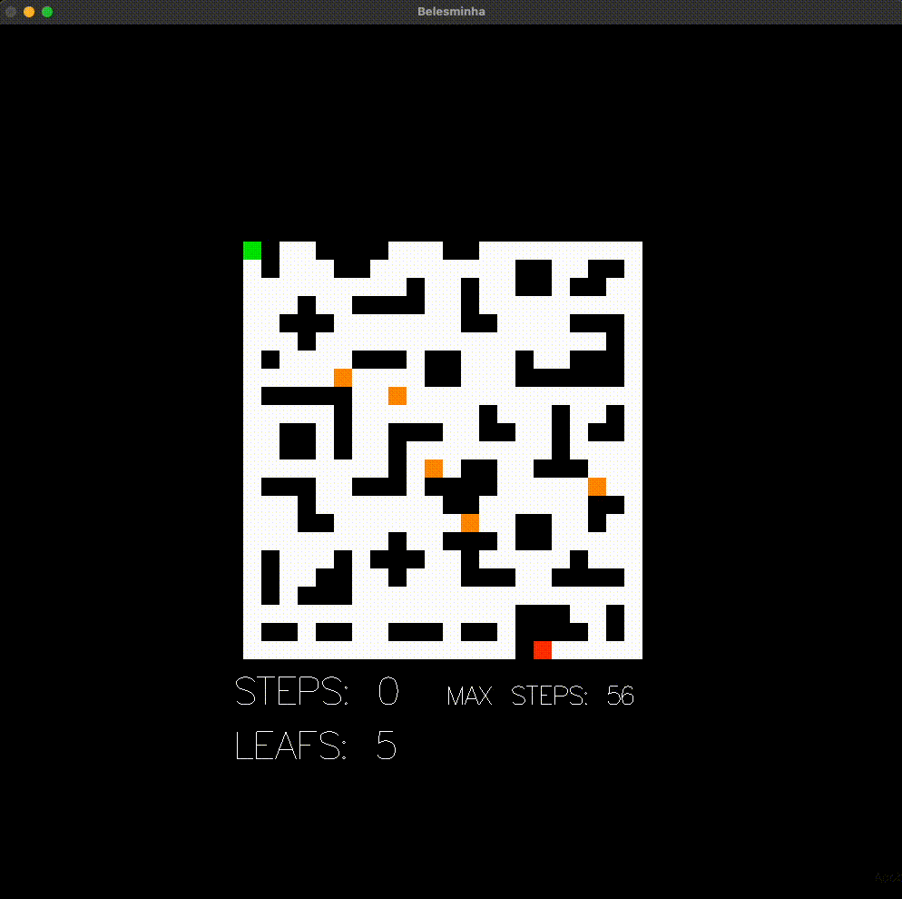
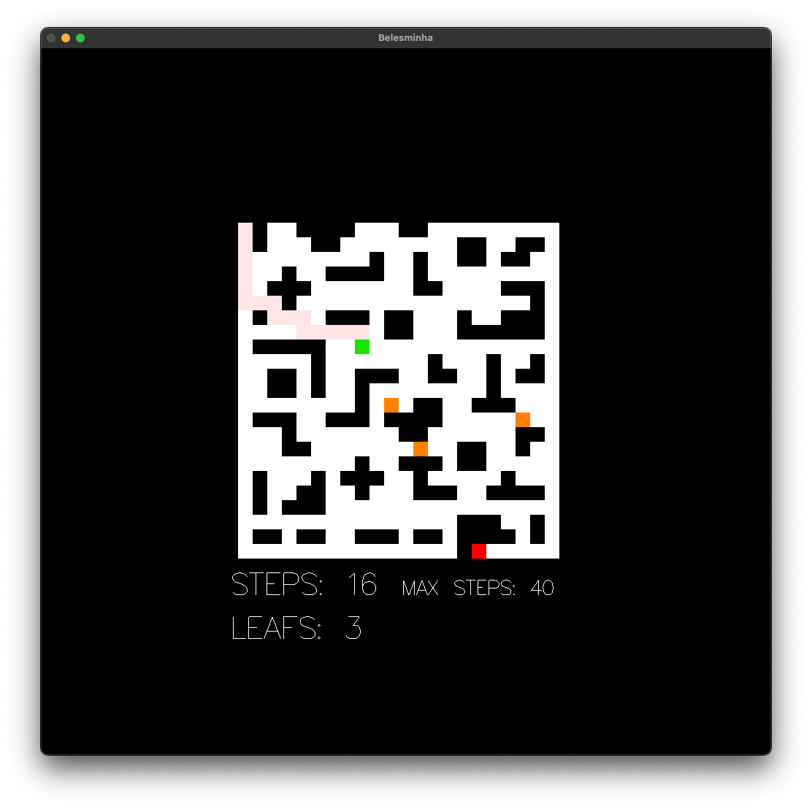

# Belesminha

**Disciplina**: FGA0210 - PARADIGMAS DE PROGRAMAÇÃO - T01 <br>
**Nro do Grupo (de acordo com a Planilha de Divisão dos Grupos)**: 02<br>
**Paradigma**: Funcional<br>

## Alunos
|Matrícula | Aluno |
| -- | -- |
|Ailton Aires|180011600|
|Arthur Sena|180030345|
|Eric Chagas de Oliveira|180119508|
|Fernando Vargas|180016491|
|Gabriel Luiz|190013354|
|Guilherme Daniel Fernandes da Silva|180018019|
|Kevin Luis|180042386|
|Matheus Monteiro|180127969|
|Thiago Vivan Bastos|190020407|
|Victor Buendia|190020601|

## Sobre 
Descreva o seu projeto em linhas gerais. 
Use referências, links, que permitam conhecer um pouco mais sobre o projeto.
Capriche nessa seção, pois ela é a primeira a ser lida pelos interessados no projeto.

## Screenshots





## Instalação 
**Linguagens**: Haskell<br>
**Tecnologias**: Gloss<br>

Pré requisitos:

- Makefile
- Docker
- Docker Compose

Descreva os pré-requisitos para rodar o seu projeto e os comandos necessários.
Insira um manual ou um script para auxiliar ainda mais.
Gifs animados e outras ilustrações são bem-vindos!

## Uso

O uso do projeto está facilitado pelos autores utilizando `Makefiles` e a instalação funciona para ambientes Linux ou MacOS. Também se pode *buildar* o projeto usando Docker. 

### Docker (Recomendado)

Você deve estar em um Linux para este método funcionar, porque o Docker compila a imagem dentro de um Ubuntu e não é possível rodar uma imagem de MacOS. Basta apenas executar o comando abaixo.

```sh
make docker-build
```

### Linux

Basta apenas executar o comando abaixo. Contudo, para a instalação do Haskell no ambiente Linux, será necessário confirmar todas as solicitudes do GHCup pressionando sempre ENTER.

```sh
make install && make
```

### MacOS

Basta apenas executar o comando abaixo.

```sh
make install && sudo make
```

## Vídeo
Adicione 1 ou mais vídeos com a execução do projeto.
Procure: 
(i) Introduzir o projeto;
(ii) Mostrar passo a passo o código, explicando-o, e deixando claro o que é de terceiros, e o que é contribuição real da equipe;
(iii) Apresentar particularidades do Paradigma, da Linguagem, e das Tecnologias, e
(iV) Apresentar lições aprendidas, contribuições, pendências, e ideias para trabalhos futuros.
OBS: TODOS DEVEM PARTICIPAR, CONFERINDO PONTOS DE VISTA.
TEMPO: +/- 15min

## Participações
Apresente, brevemente, como cada membro do grupo contribuiu para o projeto.
|Nome do Membro | Contribuição | Significância da Contribuição para o Projeto (Excelente/Boa/Regular/Ruim/Nula) |
| -- | -- | -- |
|Ailton Aires| - Desenvolvimento completo do algoritmo de Dijkstra adaptado ao contexto do projeto, que exige que o algoritmo seja rodado entre vários pontos para que ache o caminho final, passando por todas as folhas. <br/> - Recursão utilizada para calcular o caminho até cada coordenada e, em seguida, concatena os caminhos intermediários para formar o caminho completo. <br/> - Permutação da lista de coordenadas das folhas utilizando recursão. <br/> - Implementação do Game Over <br/> - Cálculo do Max Steps apresentado na tela e que é decrementado conforme o usuário percorre o caminho. <br/>  - Caso onde o usuário não consegue colher todas as folhas e chegar até o final, sendo apresentada a mensagem de Game Over e o desenho do melhor caminho no labirinto (que o usuário poderia fazer para coletar todas as folhas e chegar até o final). |Excelente|
|Arthur Sena| - Randomização da Adição de Folhas no Mapa <br/> - Impressão das folhas no mapa <br/> - Função de restart do jogo através de evento do teclado |Boa|
|Eric Chagas de Oliveira| - Criação das interfaces de menu principal e da tela com instruções do jogo <br> - tentativa de criação do menu de placar do jogador (ideia abandonada) <br> além das telas de menu, implementação do controle de estados de cada tela do menu e integração com o jogo principal| Excelente |
|Fernando Vargas|- Criação do mapa fixo do labirinto <br/> - Tentativa de criar um DFS para gerar o labirinto (ideia abandonada) <br/> - Refatorações de funções com o objetivo de seguir as convenções da comunidade do Haskell| Boa |
|Gabriel Luiz|- Implementação da validação que impede o usuário de ultrapassar paredes <br/> - Implementação do contador de folhas comidas <br/> - Implementação da funcionalidade de reiniciar o jogo (finalizada pelo Victor)| Boa
|Guilherme Daniel Fernandes da Silva|-|-|
|Kevin Luis|- Criação do mapa fixo do labirinto <br/> - Implementação da detecção de eventos do teclado (Primeira versão) <br/> - Algoritmos de geração de folhas e Impressão de folhas no mapa<br/> - Tentativa de implementar ranking com leitura e escrita de arquivo (as funcões estão prontas e funcionando na branch `feat/history`, porém ocorreu um problema na integração com o gloss)|Excelente|
|Matheus Monteiro|-|Nula|
|Thiago Vivan Bastos|- Ajuda na implementação do movimento e restrições dele <br/> - Ajuda na Implementação do reset do jogo <br/> - Ajuda na resolução de branchs coflituosas <br/> Tentativas de resolver conflitos entre a branch main e menu| Boa |
|Victor Buendia|- Criação dos tipos de dados para labirinto <br/> - Criação do mapa fixo do labirinto <br/> - Cria função de checagem se ponto faz parte do limite do labirinto <br/> - Criação do tipo de dados e dinâmica de direção no labirinto <br/> - Tentativa de criar um DFS para gerar o labirinto (ideia abandonada) <br/> - Exibição do caminho ideal na tela <br/> - Contador de passos do usuário e impressão na tela <br/> - Impressão do caminho/rastro do usuário à medida que se move <br/> - Ajuda na implementação da movimentação do player <br/> - Implementação do Gloss no projeto <br/> - Criação da Makefile para instalação e compilação do projeto <br/> Reset do jogo |Excelente|

## Outros

### Lições Aprendidas

- O Haskell, por ser um paradigma funcional, quando não utiliza IO, gera sempre um mesmo resultado (saída) para uma mesma entrada nas funções;
- A modularidade no projeto precisa ser bem pensada para que os *imports* do projeto não tenham dependência circular, e
- Participar ativamente do desenvolvimento do projeto é importante para entender o que ele faz, já que as variáveis possuem nomes que não são intuitivos.

### Percepções

- Dificuldade com a sintaxe da linguagem.
- O grupo teve dificuldade em se adaptar ao paradigma funcional.
- Percepção de que a fluidez no uso do paradigma vem ao atingir uma curva de aprendizado alta.
- Dificuldade em trabalhar com variáveis imultáveis.
- Desafio quanto ao uso do paradigma dentro do contexto do projeto.
- A organização dos módulos foi um desafio, onde não se teve a oportunidade de verificar se há outras formas de organização de código mais adequadas.
- Importância dos tipos de dados customizáveis para melhor uso do paradigma.

### Contribuições e Fragilidades

- Contribuições
    - Implementamos o labirinto e um jogo funcional, ainda que não completo;
- Fragilidades
    - Haskell não ter variáveis;
    - Dificuldade em se adaptar ao novo paradigma de programação;

### Trabalhos Futuros

Para trabalhos futuros, utilizando o Belesminha como base, sugere-se como ideias:

- Criar novos mapas ao jogo, deixando com que o usuário possa escolher qual mapa ele deseja jogar;
- Criar novas dificuldades de jogo, mudando quantos passos mínimos são oferecidos para o jogador;
- Inserir predadores (inimigos) que perseguem a Belesminha;
- Adicionar tipos de Célula que aceleram ou desaceleram o movimento da Belesminha;
- Implementar um ranking de melhor pontuação, e
- Adicionar outros items para serem utilizados pela Belesminha além das frutas/folhas.

## Fontes
Inspiração:
> https://github.com/UnBParadigmas2023-2/2023.2_G2_Funcional_EscapeFromCurry/tree/main
> https://homepages.dcc.ufmg.br/~flavioro/belesminha/Artigo-Belesminha.pdf
> https://homepages.dcc.ufmg.br/~flavioro/belesminha/regras.htm
